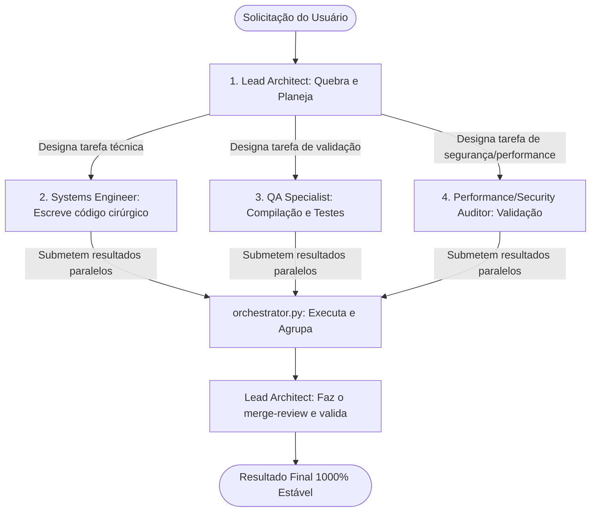

# Orquestrar Múltiplos Agentes

## Overview

Esta skill permite ao agente principal agir como um **Lead Architect / Coordinator** e subdividir problemas complexos do monorepo PixonUI em tarefas isoladas executadas por subagentes cognitivos especializados (*Senior Systems Engineer*, *QA & Verification Specialist*, *Performance & Security Auditor*).

Ela aproveita as capacidades assíncronas do terminal e um script de orquestração Python (`orchestrator.py`) para disparar compilações, testes unitários, formatações e análises de arquivos de forma paralela no workspace, agrupando os relatórios em formatos JSON curtos e estruturados que evitam o consumo desnecessário da janela de contexto (tokens).

---

## Dependencies

- **uv**: Gerenciador de pacotes Python rápido para execução do script orquestrador.
- **pixon-token-governor**: Protocolo básico de economia de tokens do monorepo.
- **pixon-surgical**: Estratégias de alteração cirúrgica com diff mínimo.

---

## Quick Start

Para inicializar a orquestração paralela quando o usuário solicitar um fluxo complexo ou demorado:

```markdown
Use a skill orquestrar-multiplos-agentes para mapear e executar as tarefas em paralelo.
```

---

## Utility Scripts

A skill é suportada pelo script CLI `orchestrator.py` localizado em `./scripts/orchestrator.py`. Este script gerencia subprocessos assíncronos com total isolamento e formatação de logs.

### Executar Tarefas em Paralelo

```bash
uv run .agents/skills/orquestrar-multiplos-agentes/scripts/orchestrator.py run-parallel --tasks "[{\"name\": \"compile_ui\", \"cmd\": \"pnpm -C packages/ui exec tsc -b\"}, {\"name\": \"test_ui\", \"cmd\": \"pnpm -C packages/ui exec vitest run\"}]" --output scratch/compilation_and_tests.json
```

O comando acima iniciará ambas as tarefas simultaneamente em subprocessos do sistema operacional e escreverá o resultado de sucesso/falha de cada um no arquivo compactado especificado por `--output`.

### Estrutura do Arquivo de Saída (`--output` JSON)

Para preservar o orçamento de tokens, os detalhes volumosos de logs com centenas de linhas são encapsulados no arquivo e resumidos no stdout:

```json
{
  "summary": {
    "total": 2,
    "success": 2,
    "failed": 0
  },
  "tasks": {
    "compile_ui": {
      "status": "success",
      "exit_code": 0,
      "log_file": "c:/PROJETOS/PixonUI/scratch/compile_ui.log"
    },
    "test_ui": {
      "status": "success",
      "exit_code": 0,
      "log_file": "c:/PROJETOS/PixonUI/scratch/test_ui.log"
    }
  }
}
```

Desta forma, o agente lê apenas a contagem geral e, se e somente se alguma tarefa falhar, abre apenas as últimas 20 linhas do arquivo de log da tarefa falha usando `view_file` direcionado com `StartLine` e `EndLine`.

---

## Protocolo de Divisão de Papéis (Cognitivo)

Ao receber a instrução, o agente assume os seguintes estados mentais para coordenação:



1. **Lead Architect (Arquiteto Líder):**
   - Mapeia o monorepo.
   - Escreve o plano de implementação centralizado.
   - Atribui orçamentos e prazos claros para os subagentes.
2. **Senior Systems Engineer (Engenheiro Sênior):**
   - Cria patches cirúrgicos e pontuais em arquivos isolados.
   - Garante que nenhuma refatoração desnecessária seja feita.
3. **QA & Verification Specialist (Especialista em QA):**
   - Prepara e executa scripts de teste em paralelo.
   - Monitora erros de tipagem (`tsc`).
4. **Performance & Security Auditor (Auditor):**
   - Procura gargalos, imports redundantes e garante o respeito às taxas de API.

---

## Rate Limiting

Não há chamadas de API externas integradas por padrão nesta skill. No entanto, se subagentes paralelos precisarem interagir com APIs (como ChEMBL, PubMed ou OpenTargets), os processos devem utilizar o mecanismo de **file-lock** embutido nos wrappers HTTP de forma que o limite global da máquina host seja estritamente respeitado em múltiplos processos.

---

## Common Mistakes

- **Poluição do Chat com Logs Gigantes:** Nunca imprima toda a saída de `pnpm build` ou `tsc -b` no chat. Sempre envie a saída para arquivos de log através do script orquestrador e examine apenas as linhas de erro.
- **Modificações Concorrentes no Mesmo Arquivo:** Garantir que dois subagentes virtuais nunca editem o mesmo arquivo simultaneamente para evitar conflitos de merge ou erros inesperados de git.
- **Ignorar Saídas de Erro:** Presumir que tarefas completaram com sucesso sem verificar o `exit_code` reportado pelo orquestrador.
